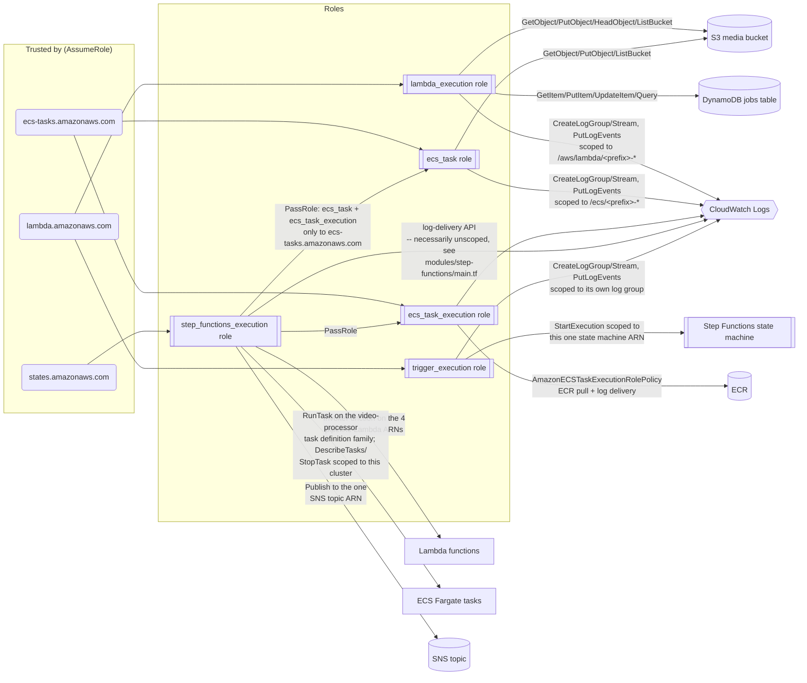

# Architecture

This document describes the **target architecture** for the full project. It is
written once, up front, and will not need major rewrites as later phases are
implemented — each phase fills in a piece of what's described here rather than
changing the design. Where something is not yet built, that's called out
explicitly.

## Phase status

| Layer | Status |
|---|---|
| S3 (media bucket) | ✅ Built — Phase 1 |
| DynamoDB (jobs table) | ✅ Built — Phase 1 |
| IAM (Lambda + ECS task roles) | ✅ Built — Phase 1 |
| Networking (VPC, public subnets, S3 gateway endpoint, ECS security group) | ✅ Built — Phase 2 |
| Lambda functions (validate, metadata, thumbnail, database) | ✅ Built — Phase 2 |
| ECR + ECS cluster + Fargate task definition | ✅ Built — Phase 2 |
| Step Functions state machine + execution IAM role | ✅ Built — Phase 3 |
| EventBridge rule (S3 → trigger Lambda → Step Functions) | ✅ Built — Phase 4 |
| SNS topic + notifications | ✅ Built — Phase 4 |
| CloudWatch dashboards/alarms | ✅ Built — Phase 4 |
| CI/CD, real execution-based tests, troubleshooting docs | ✅ Built — Phase 5 |
| API (FastAPI) | ❌ Skipped (Phase 5, optional) — see `src/api/README.md` |
| Web frontend + presign/status API (API Gateway + Lambda) | ✅ Built — Phase 6 |

## System overview

This is the state machine actually built in `step-functions/state-machine.asl.json.tpl`
(Phase 3, extended in Phase 4 with the three `Notify*` SNS states) — see
`step-functions/README.md` for the full state-by-state documentation table,
Retry/Catch rationale, and the InputPath/ResultPath/OutputPath usage this
diagram doesn't show.

```mermaid
flowchart TD
    User([User]) -->|1. Upload video| S3Upload[(S3: uploads/)]
    S3Upload -->|2. Object Created event, key prefix uploads/| EventBridge{{EventBridge Rule}}
    EventBridge -->|3. Invoke| Trigger[Lambda: trigger]
    Trigger -->|4. StartExecution job_id, bucket, key, resolutions| SFN[[Step Functions<br/>Standard Workflow]]

    SFN --> CreateJob[Task: CreateJobRecord<br/>Lambda: database]
    CreateJob --> Validate[Task: ValidateVideo<br/>Lambda: validate]
    Validate --> Choice{Choice:<br/>IsVideoValid?}

    Choice -->|invalid| FailPath[Task: HandleValidationFailure<br/>Lambda: database]
    FailPath --> NotifyValFail[Task: NotifyValidationFailure<br/>SNS Publish]
    NotifyValFail --> ValFail([Fail:<br/>VideoValidationFailed])

    Choice -->|valid| Parallel{{Parallel:<br/>ParallelProcessing}}

    Parallel --> Branch1[Task: GenerateThumbnail<br/>Lambda: thumbnail]
    Parallel --> Branch2[Task: ExtractMetadata<br/>Lambda: metadata]

    Branch1 --> RecordMedia[Task: RecordMediaDetails<br/>Lambda: database]
    Branch2 --> RecordMedia

    RecordMedia --> MapState{{Map:<br/>TranscodeAllResolutions<br/>MaxConcurrency 3}}

    subgraph MapIterations["one iteration per resolution in $.resolutions (any of the six presets)"]
        direction LR
        R1[Wait + ECS Fargate<br/>runTask.sync: 1080p]
        R2[Wait + ECS Fargate<br/>runTask.sync: 720p]
        R3[Wait + ECS Fargate<br/>runTask.sync: 480p]
    end

    MapState --> R1
    MapState --> R2
    MapState --> R3

    R1 --> RecordComplete[Task: RecordJobComplete<br/>Lambda: database]
    R2 --> RecordComplete
    R3 --> RecordComplete

    RecordComplete --> Summary[Pass: BuildExecutionSummary]
    Summary --> NotifySuccess[Task: NotifySuccess<br/>SNS Publish]
    NotifySuccess --> Succeed([Succeed:<br/>JobSucceeded])

    R1 -.Catch: States.ALL.-> ResFail[Task: RecordResolutionFailure<br/>Lambda: database]
    R2 -.Catch: States.ALL.-> ResFail
    R3 -.Catch: States.ALL.-> ResFail
    ResFail --> ResFailState([Fail: TranscodingFailed<br/>-- ends the Map iteration])
    ResFailState -.propagates.-> ProcFailHandler

    Parallel -.Catch: States.ALL.-> ProcFailHandler[Task: HandleProcessingFailure<br/>Lambda: database]
    RecordMedia -.Catch: States.ALL.-> ProcFailHandler
    MapState -.Catch: States.ALL.-> ProcFailHandler
    RecordComplete -.Catch: States.ALL.-> ProcFailHandler
    ProcFailHandler --> NotifyProcFail[Task: NotifyProcessingFailure<br/>SNS Publish]
    NotifyProcFail --> ProcFail([Fail:<br/>MediaProcessingFailed])

    S3Processed[(S3: processed/)]
    S3Thumbs[(S3: thumbnails/)]
    DDB[(DynamoDB:<br/>VideoProcessingJobs)]
    CW{{CloudWatch<br/>Logs, Dashboard & Alarms}}
    SNSTopic{{SNS: notifications topic}}
    Subscriber([Email subscriber<br/>-- optional])

    R1 --> S3Processed
    R2 --> S3Processed
    R3 --> S3Processed
    Branch1 --> S3Thumbs

    CreateJob --> DDB
    FailPath --> DDB
    RecordMedia --> DDB
    ResFail --> DDB
    RecordComplete --> DDB
    ProcFailHandler --> DDB

    NotifyValFail --> SNSTopic
    NotifyProcFail --> SNSTopic
    NotifySuccess --> SNSTopic
    CW -.ALARM/OK state change.-> SNSTopic
    SNSTopic -.confirmed subscription.-> Subscriber

    SFN -.execution history/logs.-> CW
    Validate -.logs.-> CW
    Trigger -.logs.-> CW
    R1 -.logs.-> CW
    CW -.ExecutionsFailed / ExecutionsTimedOut alarms.-> SFN
```

**Notification failures never mask the real outcome.** Each `Notify*` state
above has its own `Catch: States.ALL` routing straight to the terminal
state it precedes (an SNS outage doesn't turn a successful pipeline run into
a failed execution, or hide a real failure behind a notification-plumbing
error) — see `step-functions/README.md` for the exact ASL.

## IAM relationships



Note that `SFNRole` never calls DynamoDB directly — every job-record write in
this project flows through the `database` Lambda's `lambda_execution` role
above (the single-writer pattern), so the state machine's own IAM role has
no DynamoDB permissions attached at all. That's a smaller policy than it
might first appear needed, and it's smaller specifically *because of* that
architectural choice, not an oversight.

**Why the ECS task role and the ECS task execution role are separate roles**
(this trips people up constantly): the *task role* is assumed by your
application code at runtime — it's "what is the FFmpeg container allowed to
do with the AWS SDK". The *task execution role* is assumed by the ECS agent
itself before your container even starts — it's "what does ECS need to do to
launch this task", i.e. pull the image from ECR and set up the log stream.
Keeping them separate means a compromised application container can't use
its own credentials to, say, pull arbitrary images from ECR or read other
tasks' log configuration — it only has the narrow application-level
permissions in `ecs_task`.

**Why the Step Functions execution role was built in Phase 3, not earlier:**
its whole job is to grant access to *specific* Lambda function ARNs, a
*specific* ECS task definition ARN, and (added in Phase 4) a *specific* SNS
topic ARN. None of those existed until Phases 2–4 built them. Creating the
role earlier would have meant either wildcarding its permissions
(`lambda:InvokeFunction` on `*`) — which defeats the point of least
privilege — or writing ARNs for resources that didn't exist yet and hoping
the names lined up later. Building it in Phase 3, alongside the state
machine that needs it (`terraform/modules/step-functions/main.tf`), means
every statement in it references a real ARN — the exact same pattern the
Phase 1 `iam` module used for the Lambda/ECS roles. Phase 4 slotted in SNS
by adding exactly one more scoped `sns:Publish` policy to this same role —
the state machine's other permissions didn't change, and no earlier phase's
Terraform needed editing beyond adding one new variable
(`terraform/modules/step-functions/variables.tf`'s `sns_topic_arn`).

**Why the trigger Lambda gets its own IAM role (`trigger_execution`) instead
of reusing `lambda_execution`:** the trigger function's only job is calling
`states:StartExecution` on one specific state machine — it never touches S3
or DynamoDB. Attaching it to `lambda_execution` (which already grants S3
object read/write and DynamoDB item read/write, for the four Phase 2
functions) would hand the trigger function permissions it never calls,
purely because it happens to also be a Lambda function. A fifth, narrower
role keeps every role's permission set matching exactly what that function
does — the same reasoning `ecs_task` vs `ecs_task_execution` follows below.

## S3 key layout

```
s3://<project>-<env>-media-<account-id>/
├── uploads/<job_id>/<original-filename>
├── processed/<job_id>/<resolution>/video.mp4
├── thumbnails/<job_id>/thumbnail.jpg
└── metadata/<job_id>/metadata.json
```

Prefixes, not separate buckets — see `terraform/modules/s3/main.tf` for the
reasoning. One bucket keeps IAM policy and lifecycle-rule surface area small
for a learning project.

## DynamoDB item shape

Table: `VideoProcessingJobs` (Terraform resource name: `<project>-<env>-jobs`)
Partition key: `job_id` (String)
GSI: `status-created_at-index` (hash: `status`, range: `created_at`) — lets you
query "all jobs currently PROCESSING" or "all FAILED jobs" without a table
scan.

| Attribute | Type | Written by (state machine state) | Notes |
|---|---|---|---|
| `job_id` | S | `CreateJobRecord` | Partition key, supplied in the execution input |
| `status` | S | Every `database` Task | `PENDING` → `PROCESSING` → `SUCCESS`, or `FAILED` at any point |
| `input_bucket` / `input_key` | S | `CreateJobRecord` | Source object location |
| `requested_resolutions` | L | `CreateJobRecord` | e.g. `["1080p","720p","480p"]`, echoed from the execution input |
| `validation_errors` | L | `HandleValidationFailure` | Only set when `status = FAILED` and `failure_stage = VALIDATION` |
| `thumbnail_key` | S | `RecordMediaDetails` | S3 key under `thumbnails/` |
| `duration_seconds` / `width` / `height` / `video_codec` / `audio_codec` | N/N/N/S/S | `RecordMediaDetails` | From the `metadata` Lambda's `ffprobe` output |
| `resolutions_processed` | L | `RecordJobComplete` | List of resolution strings that finished transcoding successfully |
| `failure_stage` | S | `HandleValidationFailure` / `HandleProcessingFailure` | `VALIDATION` or `PROCESSING` — which stage of the pipeline failed |
| `failed_resolution` | S | `RecordResolutionFailure` | Only set if a specific Map iteration (resolution) failed |
| `error_info` | M | `HandleProcessingFailure` / `RecordResolutionFailure` | The ASL `Error`/`Cause` captured by whichever `Catch` fired |
| `created_at` | S | DynamoDB `ConditionExpression`-guarded create in the `database` Lambda | ISO-8601, set once, never overwritten |

This table's schema (just the partition key + GSI) was declared to Terraform
in Phase 1 — DynamoDB itself is schemaless beyond its keys. The attributes
above are all written by the `database` Lambda as directed by the Step
Functions state machine built in Phase 3 (see `step-functions/README.md`'s
state-by-state table for exactly which state writes what).

## Networking (built in Phase 2)

ECS Fargate tasks need outbound internet access to: pull images from ECR
(via VPC endpoints or NAT), reach S3 (via a free **S3 Gateway VPC Endpoint** —
no NAT Gateway needed for this), and reach the DynamoDB/CloudWatch/SNS APIs
(via **Interface VPC Endpoints**, or NAT). This project runs Fargate tasks
with `assign_public_ip = true` in **public subnets** with a tightly-scoped
security group (egress only, no inbound), which avoids the ~$32/month NAT
Gateway cost entirely for a learning project. The tradeoff and the
NAT-based/private-subnet alternative (for anyone who wants no task to ever
hold a routable public IP, a real requirement in some environments) are
documented in the header comment of `terraform/modules/networking/main.tf`.

The `public_subnet_ids` and `ecs_task_security_group_id` this module outputs
weren't consumed by anything in Phase 2 itself — the ECS task *definition*
doesn't carry network configuration in `awsvpc` mode, only individual *runs*
of it do. Phase 3's `RunTranscodeTask` state (`ecs:runTask.sync`) is what
actually consumes them, in its `NetworkConfiguration.AwsvpcConfiguration`
(see `step-functions/state-machine.asl.json.tpl`), with
`AssignPublicIp: "ENABLED"` — consistent with the no-NAT-Gateway,
public-subnet design decided here in Phase 2.

## Why metadata/thumbnail are Lambda container images, not zip + layer

`src/lambda/ffmpeg/Dockerfile` builds one shared container image for the
`metadata` and `thumbnail` functions, and both `aws_lambda_function`
resources point at that same image with a different
`image_config.command` (see `terraform/modules/lambda/main.tf`). This
wasn't the first design tried — a zip-packaged function plus a Lambda
Layer containing static `ffmpeg`/`ffprobe` binaries is the more commonly
documented pattern, and was the original plan here too. It doesn't fit:
those binaries run ~140MB *each* in every static build actually reachable
during development of this project (both a full-codec build and, by
reputation, the more minimal "static" builds people usually reach for), and
AWS caps a zip-packaged function's *unzipped* size — function code plus
every attached layer, combined — at 250MB. Two ffmpeg-family binaries alone
blow past that before a single line of Python is counted. Container images
are capped at 10GB uncompressed instead, so the exact same binaries that
don't fit as a layer fit trivially as a layer *inside* the image.

This is also, not coincidentally, why `validate` and `database` stay
zip-packaged: they have zero native dependencies (pure boto3 + stdlib), so
there's no reason to pay a container image's larger, slower-to-build,
slower-cold-start deployment unit for them. Both packaging styles are
demonstrated side by side in `terraform/modules/lambda/main.tf` — use
whichever one a given Lambda actually needs, not the same one everywhere by
default.

This does **not** contradict the "Lambda is not the place for CPU-heavy
FFmpeg processing" rule the project follows elsewhere: `metadata` only
reads a container's header structures via `ffprobe` (via a presigned URL,
so it never even downloads the source video — see that function's
docstring), and `thumbnail` decodes a single frame. Both are
sub-second-to-low-single-digit-second operations. The genuinely CPU-heavy
work — full multi-resolution transcoding — stays exactly where the spec
puts it: on ECS Fargate, driven by the Map state, in Phase 3.

## Design rationale: why Step Functions is the orchestrator, not Lambda

Putting sequencing, branching, retries, and parallelism inside one big Lambda
would make every one of those things invisible to CloudWatch/Step Functions'
execution history, untestable in isolation, and subject to a single Lambda's
15-minute max timeout for what is, in aggregate, a long-running,
multi-service workflow. Step Functions makes the control flow a
declarative, versioned artifact (the ASL definition in `step-functions/`)
that you can visualize, replay, and reason about per-state, while Lambda and
ECS stay focused on doing one thing each. This split is also what makes the
project actually demonstrate Step Functions' capabilities rather than
demonstrating "Lambda that happens to be invoked by Step Functions once".

## Step Functions orchestration (built in Phase 3)

The state machine itself — every state, its Retry/Catch policy and why,
the three timeout layers (Lambda / Step Functions Task / the complete
absence of one at the ECS layer) and how they relate, and where
InputPath/ResultPath/OutputPath are used and why — is documented in full in
**`step-functions/README.md`**, next to the actual ASL source
(`step-functions/state-machine.asl.json.tpl`). That document is kept
separate from this one deliberately: this file (`docs/architecture.md`)
describes how the pieces fit together at the system level; the
`step-functions/` docs describe the orchestration logic itself, at the
level of detail you'd want while actually reading or modifying the ASL.

Two design choices worth calling out here because they affect the system
diagram above:

- **Every DynamoDB write flows through the `database` Lambda** — the state
  machine's own IAM role has no `dynamodb:*` permissions at all (see the
  IAM relationships diagram above). This preserves the single-writer
  pattern from Phase 1/2 all the way through the orchestration layer,
  rather than Step Functions and Lambda both being able to write job state
  independently.
- **Two distinct terminal `Fail` states** (`ValidationFailedState` /
  `Error: VideoValidationFailed` and `ProcessingFailedState` / `Error:
  MediaProcessingFailed`) instead of one generic failure path — this is
  what lets Phase 4's CloudWatch Alarms distinguish "bad input" from "our
  pipeline broke" without parsing error messages.

## EventBridge, SNS, and CloudWatch (built in Phase 4)

**EventBridge trigger.** `terraform/modules/eventbridge/main.tf` creates one
rule matching S3 `Object Created` events in the media bucket with an
`object.key` prefix filter of `uploads/` — this is what stops the pipeline's
own writes to `processed/`, `thumbnails/`, and `metadata/` from
re-triggering itself; without that filter, EventBridge notifications (which
Phase 1's `aws_s3_bucket_notification` turns on for the *whole* bucket) fire
for every object create regardless of prefix. The rule's target is a thin
`trigger` Lambda (`src/lambda/trigger/handler.py`), not the state machine
directly, because turning an S3 key into a Step Functions execution input
needs actual string parsing (deriving `job_id` from
`uploads/<job_id>/<filename>`) that EventBridge's Input Transformer can't
express — it substitutes values, it doesn't split strings.

The trigger function's `StartExecution` call uses the job_id itself as the
execution name (not a name + timestamp). Standard Workflow executions are
idempotent on `(name, input)` for 90 days, so a duplicate EventBridge
delivery of the same upload event — which AWS's own docs say can happen —
calls `StartExecution` again with the same name and input and gets back the
ARN of the already-running execution instead of starting a redundant one.
See the docstring at the top of `src/lambda/trigger/handler.py` for the
tradeoff this implies (re-uploading to the exact same `job_id` key within
that window won't start a second execution).

**SNS.** One topic (`terraform/modules/sns/main.tf`), not separate
success/failure topics — the three ASL states that publish to it
(`NotifySuccess`, `NotifyValidationFailure`, `NotifyProcessingFailure`; see
the system diagram above) each set a distinct `Subject`, which is enough for
a learning project's single optional email subscription to tell outcomes
apart. Every `Notify*` state has its own `Catch: States.ALL` routed straight
to the terminal state it precedes, so an SNS-side problem (bad topic ARN,
throttling, whatever) can never turn a successful run into a failed
execution, or swallow a real failure behind a notification error.

**CloudWatch.** Two alarms (`terraform/modules/cloudwatch/main.tf`) —
`ExecutionsFailed` and `ExecutionsTimedOut` on the state machine, both
publishing to the same SNS topic on both ALARM and OK transitions — plus one
dashboard charting Step Functions execution counts/duration, all five
Lambda functions' invocations/errors, and DynamoDB consumed capacity.
Deliberately excluded: a per-Lambda-function error alarm (every Lambda
failure this pipeline can have already surfaces as `ExecutionsFailed` once
Retry is exhausted and Catch routes to a Fail state, so a duplicate
per-function alarm would just double-page the same incident) and an
ECS/Fargate CPU/Memory dashboard widget (the video-processor task runs via
`ecs:RunTask`, not an ECS Service, so the `AWS/ECS` namespace's useful
per-run metrics require Container Insights — a real recurring per-metric
cost this learning project doesn't take on, documented as a dashboard text
widget rather than a silent omission).

## Web frontend + presign/status API (built in Phase 6)

Purely additive: a third way to trigger and observe the same pipeline
(alongside the manual `start-execution` CLI path and the Phase 4 S3-upload
auto-trigger), and the only one with a visual, real-time view of execution
progress. Nothing built in Phases 1-5 depends on this module, or even knows
it exists — it consumes `module.s3`'s bucket and `module.step_functions`'s
state machine ARN as plain read-only inputs, the same way `module.eventbridge`
does, and is created last in `terraform/main.tf` for the identical reason
(it needs `state_machine_arn`, which doesn't exist until Phase 3 has run).

**Why one Lambda for two routes.** Every other Lambda in this project is
one function per concern (`validate`, `database`, `metadata`, `thumbnail`,
`trigger`) — different timeout/memory profiles, different triggers,
different blast radius if one misbehaves. `web_api`'s two routes
(`POST /presign`, `GET /status/{job_id}`) don't have any of those reasons to
split: both are small, read-mostly, share one IAM role's worth of
permissions, and exist purely to serve one frontend. A single Lambda with an
internal router (`src/lambda/web_api/handler.py`'s `lambda_handler`)
dispatching on `event["requestContext"]["http"]["method"]` +
`event["rawPath"]` keeps the infrastructure footprint down without actually
losing any of the separation that matters (the two routes still have
separately-scoped IAM statements within that one role — presign can only
`s3:PutObject` under `uploads/*`; status can only `states:DescribeExecution`
/ `states:GetExecutionHistory` on this state machine's executions, never
`StartExecution`).

**Collapsing ~20 ASL states onto 9 frontend nodes.** The state machine
(`step-functions/state-machine.asl.json.tpl`) has states for plumbing —
`IsVideoValid` (Choice), `BuildExecutionSummary` (Pass), `StaggerLaunch`
(Wait), the three `Handle*Failure` Tasks — that a human watching a progress
bar doesn't need surfaced individually. `web_api`'s `_STATE_TO_NODE` mapping
picks the 9 states a viewer actually cares about (Initialize Job → Validate
→ [Generate Thumbnail | Extract Metadata] in parallel → Record Media Details
→ Transcode → Record Job Complete → Notify → Done) and derives each one's
`pending`/`running`/`succeeded`/`failed` status by walking
`GetExecutionHistory`'s `stateEnteredEventDetails`/`stateExitedEventDetails`
events for just those names. `TranscodeAllResolutions` is a Map state, so
its inner `RunTranscodeTask` state enters/exits once per resolution (default
3) rather than once overall — tracked as a running count
(`transcode_entered`/`transcode_exited`) so the frontend can show
"2/3 resolutions complete" instead of a single opaque spinner. `Fail` and
`Succeed` states get special-cased too: *entering* one is itself terminal
(neither type ever "exits" the way a `Task` does), so `ValidationFailedState`
/ `ResolutionFailed`/`ProcessingFailedState` immediately mark the `done` node
failed, and `JobSucceeded` immediately marks it succeeded, on entry rather
than waiting for an exit event that will never come.

**Deliberately open CORS / public S3 read.** The API Gateway HTTP API's
`cors_configuration` allows any origin, and the frontend S3 bucket's policy
grants anonymous `s3:GetObject` — appropriate for a public demo page with no
secrets in it (the only privileged operations, presigning uploads and
reading execution state, happen through `web_api`'s own scoped IAM role, not
through anything public), but a deliberate simplification worth tightening
(`allow_origins`, real auth in front of `/presign`) before this pattern is
reused for anything handling real user data. No CloudFront/ACM/HTTPS either
— the frontend bucket serves plain HTTP via S3 website hosting, the simplest
option for a learning project's demo page.
